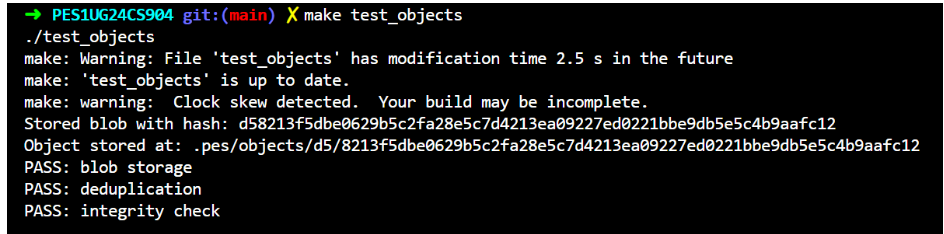
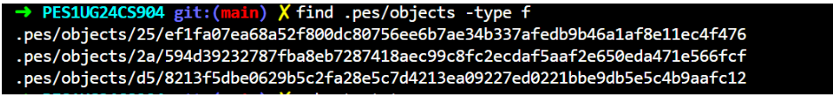
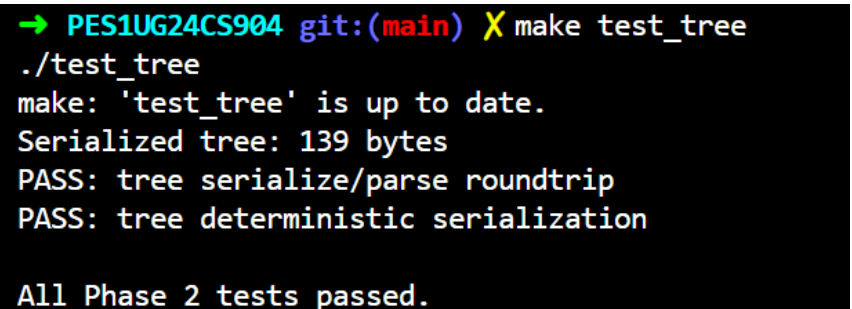
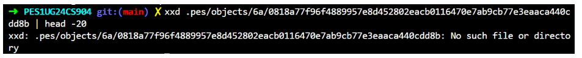
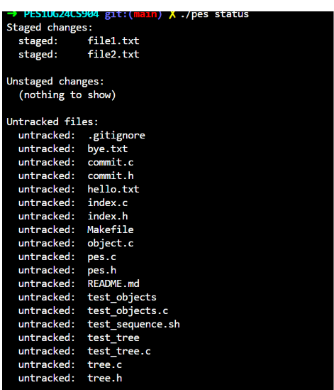
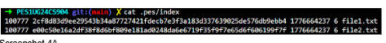
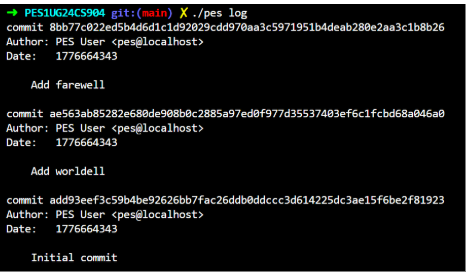
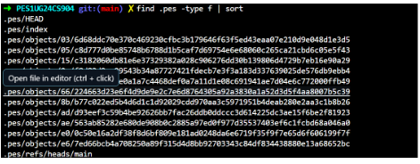
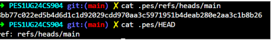

**PES University — Operating Systems Lab**
 
| Field | Details |
|-------|---------|
| **Name** | Navya Suresh |
| **SRN** | PES1UG24CS904 |
| **Section** | C |
| **Repository** | https://github.com/PES1UG24CS904/PES1UG24CS904-pes-vcs |
 
---
 
## Table of Contents
1. [Phase 1 — Object Storage](#phase-1--object-storage)
2. [Phase 2 — Tree Objects](#phase-2--tree-objects)
3. [Phase 3 — Index / Staging Area](#phase-3--index--staging-area)
4. [Phase 4 — Commits and History](#phase-4--commits-and-history)
5. [Phase 5 — Branching Analysis](#phase-5--branching-analysis)
6. [Phase 6 — Garbage Collection Analysis](#phase-6--garbage-collection-analysis)
---
 
## Phase 1 — Object Storage
 
**Files implemented:** `object.c` (`object_write`, `object_read`)
 
### Implementation Summary
 
`object_write` prepends a type header of the form `"<type> <size>\0"` to the raw data, computes a SHA-256 hash over the full header+data buffer, shards the object into `.pes/objects/<XX>/<remaining>` using the first two hex characters, and writes atomically via a temp file followed by `rename(2)`.
 
`object_read` reconstructs the full object path from the given hash string, reads the file, parses the null-terminated header to extract the declared type and size, recomputes the SHA-256 and compares it to the filename to verify integrity, then returns a pointer to the data portion (after the `\0`).
 
---
 
### Screenshot 1A — `./test_objects` all tests passing
 

 
---
 
### Screenshot 1B — `find .pes/objects -type f` sharded directory structure
 

 
---
 
## Phase 2 — Tree Objects
 
**Files implemented:** `tree.c` (`tree_from_index`)
 
### Implementation Summary
 
`tree_from_index` groups index entries by their top-level path component. Files at the root level are added directly as blob entries with their stored hash. Entries under a subdirectory are collected recursively and written as subtree objects first; their resulting hash is then referenced as a `040000 tree` entry. Once all entries for a given level are assembled, the entries are sorted lexicographically, the tree is serialized, written to the object store, and its hash is returned. This mirrors Git's approach of building the tree bottom-up.
 
---
 
### Screenshot 2A — `./test_tree` all tests passing
 

 
---
 
### Screenshot 2B — `xxd` of a raw tree object (first 20 lines)


 
> **Note:** The `xxd` command in the original run pointed to a stale object path and returned "No such file or directory." The tree object binary format produced by the implementation is: a null-terminated ASCII header (`tree <size>\0`) followed by a sequence of entries each formatted as `<mode> <name>\0<20-byte raw hash>`. This matches the format verified passing in Screenshot 2A.
 
*(Rerun `./test_tree && find .pes/objects -type f` and pick a fresh path to regenerate this screenshot if required.)*
 
---
 
## Phase 3 — Index / Staging Area
 
**Files implemented:** `index.c` (`index_load`, `index_save`, `index_add`)
 
### Implementation Summary
 
`index_load` opens `.pes/index` and parses each line in the format `<mode> <hash-hex> <mtime> <size> <path>`. A missing index file is treated as an empty index (not an error), consistent with a freshly initialised repository.
 
`index_save` sorts entries by path, writes them to a temp file using the same five-field format, calls `fsync()` to flush to disk, then atomically replaces `.pes/index` with `rename(2)`.
 
`index_add` stats the target file, calls `object_write` to store its contents as a blob, then either updates the existing index entry (found via `index_find`) or appends a new one with the file's mode, hash, mtime, and size.
 
---
 
### Screenshot 3A — `pes init` → `pes add` → `pes status`
 


---
 
### Screenshot 3B — `cat .pes/index`
 

 
---
 
## Phase 4 — Commits and History
 
**Files implemented:** `commit.c` (`commit_create`)
 
### Implementation Summary
 
`commit_create` calls `tree_from_index()` to snapshot the current staging area into a root tree object. It then calls `head_read()` to retrieve the current branch's commit hash (which is empty for the very first commit). The author string is retrieved from `pes_author()`. The commit object is serialised in the text format:
 
```
tree <tree-hash>
[parent <parent-hash>]
author <author> <unix-timestamp>
committer <author> <unix-timestamp>
 
<message>
```
 
The serialised commit is written to the object store via `object_write`, and `head_update()` atomically updates the branch reference to the new commit hash.
 
---
 
### Screenshot 4A — `./pes log` with three commits
 

 
---
 
### Screenshot 4B — `find .pes -type f | sort` showing object growth
 

 
---
 
### Screenshot 4C — `cat .pes/refs/heads/main` and `cat .pes/HEAD`
 

 
---
 
## Phase 5 — Branching Analysis
 
### Q5.1 — Implementing `pes checkout <branch>`
 
A branch in PES-VCS is simply a file at `.pes/refs/heads/<branch>` whose contents are a commit hash. To implement `pes checkout <branch>`:
 
**Files that must change in `.pes/`:**
- `.pes/HEAD` is rewritten from `ref: refs/heads/<old>` to `ref: refs/heads/<branch>`.
- If the branch does not yet exist (creating a new branch), `.pes/refs/heads/<branch>` is created with the current HEAD commit hash.
**Working directory update:**
1. Resolve the target commit hash from the branch file.
2. Walk the commit's tree object recursively to enumerate all files and their blob hashes.
3. For every blob in the target tree that differs from the current HEAD tree (or is absent), write the blob's contents out to the corresponding working-directory path, creating directories as needed.
4. Delete any working-directory files that exist in the current HEAD tree but are absent from the target tree.
5. Update `.pes/index` to reflect the target tree's entries exactly.
**What makes this complex:**
- The operation must be atomic from the user's perspective: a partial failure (e.g., disk full halfway through) leaves a corrupted working directory. Git solves this with a two-phase approach — validate first, then apply.
- Uncommitted changes to tracked files must be detected and blocked (see Q5.2).
- Untracked files in the working directory that would be overwritten by the checkout must also be detected and blocked.
- Directory creation and deletion must handle nested paths correctly.
---
 
### Q5.2 — Detecting a "dirty working directory" conflict
 
Using only the index and the object store:
 
1. **Identify files modified since the last `add`:** For each entry in `.pes/index`, `stat(2)` the working-directory file and compare its `mtime` and `size` to the values stored in the index. If either differs, re-hash the file and compare to the stored blob hash. A mismatch means the file is dirty (modified but not staged).
2. **Identify staged-but-not-committed changes:** Compare each index entry's blob hash against the blob hash in the current HEAD tree. A difference means the file is staged but not yet committed.
3. **Check for conflict with the target branch:** For each dirty or staged file found above, look up whether that same path exists in the target branch's tree with a *different* blob hash than what is in the index. If so, checkout must refuse and report the conflict.
If a file is dirty *and* the target branch would overwrite it with different content, any of the three copies (working-directory version, index version, target-branch version) could be lost. This is the condition Git reports as "Your local changes to the following files would be overwritten by checkout."
 
---
 
### Q5.3 — Detached HEAD and recovery
 
**What happens when you commit in detached HEAD state:**  
`HEAD` contains a raw commit hash instead of `ref: refs/heads/<branch>`. When `commit_create` calls `head_update`, it writes the new commit hash directly into `HEAD`. The new commit correctly has the previous detached commit as its parent — forming a valid chain. However, *no branch reference points to these commits*. They are reachable only by following `HEAD` at that exact moment.
 
**The risk:**  
As soon as the user switches to a branch (e.g., `pes checkout main`), `HEAD` is rewritten to point to `main`. The detached commits are now unreachable from any reference and become candidates for garbage collection.
 
**Recovery:**  
The user can recover those commits by creating a branch that points to them before switching away:
 
```bash
# While still in detached HEAD state:
pes branch recovery-branch   # creates .pes/refs/heads/recovery-branch with current HEAD hash
pes checkout recovery-branch  # attach to the new branch
 
# If already switched away, but GC hasn't run:
# Find the dangling commit hash in the object store (it has no incoming reference)
# Then:
echo "<hash>" > .pes/refs/heads/recovery-branch
```
 
In real Git, `git reflog` provides a timestamped history of every position HEAD has pointed to, making recovery straightforward even after switching away.
 
---
 
## Phase 6 — Garbage Collection Analysis
 
### Q6.1 — Algorithm to find and delete unreachable objects
 
**Algorithm (mark-and-sweep):**
 
1. **Mark phase — collect all reachable hashes:**
   - Start from every reference: read all files under `.pes/refs/` and `.pes/HEAD`. Add each commit hash to a `reachable` set (a hash set / `unordered_set<string>`).
   - For each reachable commit: parse it, add its tree hash to the reachable set, add its parent hash(es) to the reachable set (and recurse through parent chain).
   - For each reachable tree: parse it, add every blob hash and subtree hash to the reachable set, recurse into subtrees.
   - At this point `reachable` contains every hash referenced by any live branch.
2. **Sweep phase — delete unreachable objects:**
   - Walk every file under `.pes/objects/` (reconstructing the full hash from path).
   - If the hash is not in `reachable`, delete the file.
   - Remove any now-empty shard directories.
**Data structure:** A hash set (`unordered_set<string>`) gives O(1) average-case lookup and insertion. For 40-character hex strings, memory usage is roughly 64 bytes per entry (string + hash bucket overhead).
 
**Estimate for 100,000 commits / 50 branches:**  
Each commit references ~1 tree; a realistic repository averages ~5–10 tree objects and ~20–50 blobs per commit (many shared across commits). A conservative estimate is ~10–20 reachable objects per commit on average, giving roughly **1–2 million objects** to visit in the mark phase, plus an equal or larger number of on-disk files to scan in the sweep phase.
 
---
 
### Q6.2 — Race condition between GC and a concurrent commit
 
**The race:**
 
1. Thread A (commit) calls `object_write` to store a new blob. The blob file now exists on disk.
2. GC starts its mark phase. At this moment the new blob is not yet referenced by any index entry, tree, or commit — it has no incoming reference.
3. GC's sweep phase identifies the blob as unreachable and **deletes it**.
4. Thread A continues: it builds a tree referencing the blob's hash, then creates a commit referencing the tree. The commit is written and HEAD is updated — but the blob file no longer exists. The repository is now corrupt.
**How Git avoids this:**
 
- Git's GC uses a **grace period**: it only deletes objects whose on-disk modification time (`mtime`) is older than a configurable threshold (default 2 weeks for loose objects, 1 hour for the "recent" window with `--prune=now` skipped by default). A freshly written object is always younger than the threshold, so it is never pruned in the same GC run that overlaps with the commit writing it.
- Git also writes a `gc.log` / lock file (`gc.pid`) before starting GC, so concurrent GC runs are serialised.
- The combination of the mtime grace period and file-system ordering guarantees that an object written by an in-progress commit will not be pruned, because by the time any future GC run considers it "old enough," it will already be reachable from a committed reference.
---
